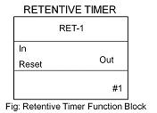

### **Concept of Timer**
The controller used in DCS has an inbuilt clock for its functioning. This clock is used for executing the instruction cycle or scan cycle or in case any of important actions.

There are two types of delay required or available in the entire operation
* Logical delay
* Process delay
This internal clock is used as a reference when it is necessary to have a logical delay in the program. Depending on number of cycles of the clock the calculation of the delay is calculated. The base time of the delay can vary for different manufacturers e.g. 1ms, 10ms or 1s. It is based on the crystal oscillator present in the controller whose time is taken as the reference for the calculation.

### **Concept of Counter**
In timer, the internal clock of the controller is considered for calculation of the delay, the same clock can be used to calculate the external pulses of the physical world.
Suppose there is an application where in we need to count the number of balls entering the vessel. A limit switch as a sensor can sense the ball as it comes to the vessel. The high to low transition at the sensor output can be counted by taking the reference of the internal clock pulse of the controller.

### **TYPES OF TIMERS**
Three types of timers available in DCS are On delay, Off delay and Retentive timer.

#### **1) On Delay Timer (OND):** 
On delay timers are preferred in most of the applications.
The example to demonstrate the function and operation of a timer is a firecracker. The firecracker when it is lighted it takes some time to burst because of the lead present which we light. Thus after burning the lead, which is the delay the cracker burst. Now in terms of On Delay Timer when a high/true/active signal is given at the input, time duration specified, the output of the timer block becomes high only after the specified time duration is elapsed.
The function block and timing diagram for On Delay Timer is shown below:

#### **2) Off Delay Timer (OFFD):** 
In Off Delay Timer, the output remains high until a high to low pulse is applied at the input terminal. The output goes low after the time duration specified has elapsed if a high to low transition is applied at input. The functional block diagram and timing diagram of the same is shown below:

#### **3) Retentive Timer (RET):** 
In the above timers if the input signal changes its value back to original, before the specified time duration is elapsed, the timer resets. It does not retain its value. In order to overcome this problem retentive timer is used. As the name suggests, it retains the value even if the input signal changes back to original state before time duration has elapsed. These type of timers are used in real time clocks where retention of time value is important. The block diagram and timing diagram of the same is shown below:

### TYPES OF COUNTERS

Two types of counters are generally used in DCS.
**1) Up Counter:** Up Counter counts input pulses in incremental manner i.e. it starts counting from 0 to the value specified as preset value. When the preset value and no of counts becomes equal the output of the counter becomes high.
**2) Down Counter:** Down Counter counts input pulses in decrement manner i.e. it starts counting from the value specified in preset to 0 values. This can be done when input goes from high to low or low to high as we select in the function block. When the preset decrements to 0 value, the output of the counter becomes high.
**Note:** The up and down counter function can be implemented in same counter block. We need to select the type as up or down counting.The input signal form in which counting is to be done i.e. from low to high or from high to low is also selectable.
The block diagram of counter and its timing diagram:

### The Function Block Diagram and Timing diagrams are as per the available Emerson Delta V DCS in College of Engineering Pune